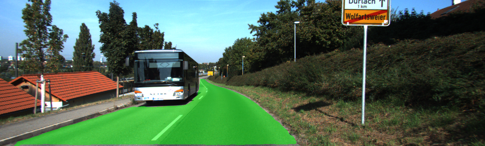

# KittiSeg

KittiSeg performs segmentation of roads by utilizing an FCN based model. The model achieved [first place](http://www.cvlibs.net/datasets/kitti/eval_road_detail.php?result=ca96b8137feb7a636f3d774c408b1243d8a6e0df) on the Kitti Road Detection Benchmark at submission time and is descripted in our paper: [MultiNet](https://arxiv.org/abs/1612.07695).

   

   

The model is designed to perform well on small datasets. The training is done using just *250* densely labelled images. Despite this a state-of-the art MaxF1 score of over *96%* is achieved. The model is usable for real-time application. Inference can be performed at the impressive speed of *95ms* per image.

The code contains for `train`, `evaluate` and `visualize` semantic segmentation in Tensorflow. It is build to be compatible with the [TensorVision](http://tensorvision.readthedocs.io/en/master/user/tutorial.html#workflow) backend which allows to organize experiments in a very clean way. Also check out [KittiBox](https://github.com/MarvinTeichmann/KittiBox#kittibox), a similar project implementing a state-of-the art Car detection approach.

## Requirements

The code requires Tensorflow 1.0 as well as the following python libraries: 

* matplotlib
* numpy
* Pillow
* scipy

Those modules can be installed using: `pip install numpy scipy pillow matplotlib` or `pip install -r requirements.txt`.

### Tensorflow 1.0rc

This code requires `Tensorflow Version >= 1.0rc` to run. There have been a few breaking changes recently. If you are currently running an older tensorflow version, I suggest creating a new `virtualenv` and install 1.0rc using:

```bash
export TF_BINARY_URL=https://storage.googleapis.com/tensorflow/linux/gpu/tensorflow_gpu-1.0.0rc0-cp27-none-linux_x86_64.whl
pip install --upgrade $TF_BINARY_URL
```

Above commands will install the linux version with gpu support. For other versions follow the instructions [here](https://www.tensorflow.org/versions/r1.0/get_started/os_setup).


## Setup

1. Clone this repository: `git clone https://github.com/MarvinTeichmann/KittiSeg.git`
2. Initialize all submodules: `git submodule update --init --recursive`
3. [Optional] Download Kitti Road Data:
    1. Retrieve kitti data url here: [http://www.cvlibs.net/download.php?file=data_road.zip](http://www.cvlibs.net/download.php?file=data_road.zip)
    2. Call `python download_data.py --kitti_url URL_YOU_RETRIEVED`
    
Running the model using `demo.py` does not require you to download kitti data (step 3). Step 3 is only required if you want to train your own model using `train.py` or bench a model agains the official evaluation score `evaluate.py`. Also note, that I recommend using `download_data.py` instead of downloading the data yourself. The script will also extract and prepare the data. See Section [Managing Folders](README.md#managing-folders) if you like to control where the data is stored.


## Tutorial

### Getting started

Run: `python demo.py --input_image data/demo/demo.png` to obtain a prediction using [demo.png](data//demo/demo.png) as input.

Run: `python evaluate.py` to evaluate a trained model. 

Run: `python train.py` to train a new model on the Kitti Data.

If you like to understand the code, I would recommend looking at [demo.py](demo.py) first. I have documented each step as  	thoroughly as possible in this file.


### Manage Data Storage

KittiSeg allows to separate data storage from code. This is very useful in many server environments. By default, the data is stored in the folder `KittiSeg/DATA` and the output of runs in `KittiSeg/RUNS`. This behaviour can be changed by setting the bash environment variables: `$TV_DIR_DATA` and `$TV_DIR_RUNS`.

Include  `export TV_DIR_DATA="/MY/LARGE/HDD/DATA"` in your `.profile` and the all data will be downloaded to `/MY/LARGE/HDD/DATA/data_road`. Include `export TV_DIR_RUNS="/MY/LARGE/HDD/RUNS"` in your `.profile` and all runs will be saved to `/MY/LARGE/HDD/RUNS/KittiSeg`

### RUNDIR and Experiment Organization

KittiSeg helps you to organize large number of experiments. To do so the output of each run is stored in its own rundir. Each rundir contains:

* `output.log` a copy of the training output which was printed to your screen
* `tensorflow events` tensorboard can be run in rundir
* `tensorflow checkpoints` the trained model can be loaded from rundir
* `[dir] images` a folder containing example output images. `image_iter` controls how often the whole validation set is dumped
* `[dir] model_files` A copy of all source code need to build the model. This can be very useful of you have many versions of the model.

To keep track of all the experiments, you can give each rundir a unique name with the `--name` flag. The `--project` flag will store the run in a separate subfolder allowing to run different series of experiments. As an example, `python train.py --project batch_size_bench --name size_5` will use the following dir as rundir:  `$TV_DIR_RUNS/KittiSeg/batch_size_bench/size_5_KittiSeg_2017_02_08_13.12`.

Use the flag `--nosave` if you do not want to save all output in an rundir. This is very useful for debugging, if you are not interested in the actual output and you do not want to spam your `rundir`. `--nosave` will use the folder `$TV_DIR_RUNS/debug` as output. So you can still few the rundir, but it will be overwritten by the next `--nosave` run.

### Modifying Model & Train on your own data

The model is controlled by the file `hypes/KittiSeg.json`. Modifying this file should be enough to train the model on your own data and adjust the architecture according to your needs. A description of the expected input format can be found [here](inputs/inputs.md). I would advise to creat a new hype file `hypes/my_hype.json` for your input data and start trainining by running: `python train.py --hypes hypes/my_hype.json`


For advanced modifications, the code is controlled by 5 different modules, which are specified in `hypes/KittiSeg.json`.

```
"model": {
   "input_file": "../inputs/kitti_seg_input.py",
   "architecture_file" : "../encoder/fcn8_vgg.py",
   "objective_file" : "../decoder/kitti_multiloss.py",
   "optimizer_file" : "../optimizer/generic_optimizer.py",
   "evaluator_file" : "../evals/kitti_eval.py"
},
```

Those modules operate independently. This allows easy experiments with different datasets (`input_file`), encoder networks (`architecture_file`), etc. Also see [TensorVision](http://tensorvision.readthedocs.io/en/master/user/tutorial.html#workflow) for a specification of each of those files.


## Utilize TensorVision backend

KittiSeg is build on top of the TensorVision [TensorVision](https://github.com/TensorVision/TensorVision) backend. TensorVision modularizes computer vision training and helps organizing experiments. 


To utilize the entire TensorVision functionality install it using 

`$ cd KittiSeg/submodules/TensorVision` <br>
`$ python setup install`

Now you can use the TensorVision command line tools, which includes:

`tv-train --hypes hypes/KittiSeg.json` trains a json model. <br>
`tv-continue --logdir PATH/TO/RUNDIR` continues interrupted training <br>
`tv-analyze --logdir PATH/TO/RUNDIR` evaluated trained model <br>


## Useful Flags & Variabels

Here are some Flags which will be useful when working with KittiSeg and TensorVision. All flags are available across all scripts. 

`--hypes` : specify which hype-file to use <br>
`--logdir` : specify which logdir to use <br>
`--gpus` : specify on which GPUs to run the code <br>
`--name` : assign a name to the run <br>
`--project` : assign a project to the run <br>
`--nosave` : debug run, logdir will be set to `debug` <br>

In addition the following TensorVision environment Variables will be useful:

`$TV_DIR_DATA`: specify meta directory for data <br>
`$TV_DIR_RUNS`: specify meta directory for output <br>
`$TV_USE_GPUS`: specify default GPU behaviour. <br>

On a cluster it is useful to set `$TV_USE_GPUS=force`. This will make the flag `--gpus` mandatory and ensure, that run will be executed on the right GPU.

# Citation

If you benefit from this code, please cite our paper:

```
@article{teichmann2016multinet,
  title={MultiNet: Real-time Joint Semantic Reasoning for Autonomous Driving},
  author={Teichmann, Marvin and Weber, Michael and Zoellner, Marius and Cipolla, Roberto and Urtasun, Raquel},
  journal={arXiv preprint arXiv:1612.07695},
  year={2016}
}
```

